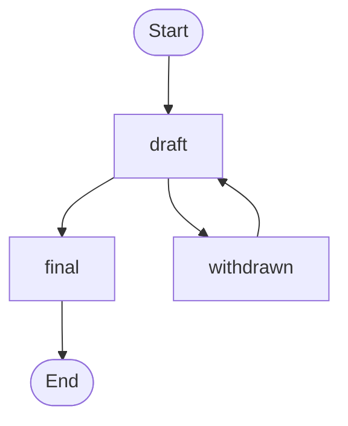

# Asking Stakeholders for Knowledge 2t3c 提案プロセス

## 要約

Asking Stakeholders for Knowledge 2t3c は、地域コミュニティに情報を提供する文書です。ASK-2t3c の目的は、コミュニティの課題解決に貢献することです。

この文書は、ASK-2t3c の公開範囲、形式、プロセスについて説明しています。

## 範囲と目標

ASK-2t3c はコミュニティにとって関心のある話題に関して、簡潔かつ焦点を絞った文書化を行います。

この手続きはあまりに冗長ですが、それは長期に保存・公開する文書を想定しているためです。

内容に定めを設けませんが、文書には以下が含まれることが期待されます。

- 当事者の痛み
- 思い込みと実態のちがい
- 解決手段の提案
- 技術的プロトコルやメカニズム
- 面白くてユーモラスなことがら

## ライセンス

すべてのASC-2t3cは[AGPL-3.0](LICENSE)で公開されます。

## 言語、文書構造、様式

文書は[CommonMark](https://spec.commonmark.org/0.29/)でフォーマットされなければなりません。

言語について特に定めませんが、忘れないでください: これは情報提供書です。読者やメンテナが理解できなければ役に立ちません。

著者は包摂的な言葉や例を使い、抑圧的な言葉遣いを避けなければなりません。

## 提案タイトル、識別子

すべての文書には説明的なタイトルが必要です。

タイトルからsha256ハッシュを算出し、冒頭4桁を識別子とします。標準のUnixツールで計算することができます。

```bash
echo -n 'Asking Stakeholders for Knowledge 2t3c 提案プロセス' | sha256sum | cut -c-4
0e99
```

ハッシュを使用することで、メンテナが固有のIDを割り当てる負担を減らすことができます。

タイトルが固有のものである必要があります。

## 接頭辞

2t3cは、千代田区の地方公共団体コード `131016` の Base36 表現です。千代田区について扱っていることを一意に示すために、接頭辞として期待されています。

`ASK-2t3c-0e99` のような形式です。

## 提案プロセス



すべてのコミュニケーションは、誠実さと人間らしさを保たねばなりません。テキストコミュニケーションにはつねにネガティブなニュアンスが（不随意に、随意であればより強力に）加わることに留意してください。

1. 著者は、任意の手段（プルリクエストなど）で文書をメンテナに提出してください。
   - この時点では、文書に `draft` 状態が付与されています。
   - 文書と同じタイトルで issue を作成してください。文書に関する会話を追跡するためです。
   - 別の場所で会話をしている場合でも、この issue にリンクを残すか、要約を記載するなどして追跡できるようにしてください。
   - GitHub アカウントが利用できない場合は、メンテナに任意の手段で依頼してください。
2. メンテナは、受け取った文書が範囲と目的に合っているか確認してください。
   - 明らかにプロセスの誤用であれば、提出を拒否してください。
3. 著者は、文書の更新をメンテナにリクエストできます。
   - 更新時に `withdrawn` 状態を付与することで、著者が文書の撤回を望んでいることを明示できます。
   - 更新時に `final` 状態を付与することで、著者が文書の確定を望んでいることを明示できます。文書の性質にもよりますが、会話が十分に成熟した後が望ましいです。いちど `final` した後の文書は、原則として変更できないことに留意してください。
4. 著者は、`final` した文書を破壊的に変更したい場合、既存の文書を変更するのではなく、新たな文書を提出してください。
   - 新たな文書に `replaces` メタデータを作成し、古い文書の識別子を付与してください。
   - 古い文書に `replaced_by` メタデータを作成し、新たな文書の識別子を付与してください。

## メタデータ

文書には YAML Frontmatter で以下のメタデータを付与する必要があります。

これは網羅的な例です。著者向けに限定された例は [d2d4 文書を書くためのメタデータの例](d2d4.md) をご覧ください。

```markdown
---
slug: "識別子（文字列であることを明示するため、ダブルクオーテーションで囲む必要があります。）"
title: 説明的なタイトル
tracking_issue: issueへのリンク
authors:
  - 著者名 <メールアドレスなど連絡先>
status: draft または withdrawn または final
created: YYYY-MM-DD
updated: YYYY-MM-DD（任意: プッシュするたびに書き換える必要はありませんが、マージするときくらいは更新してください）
replaced_by: "識別子（任意）"
replaces: "識別子（任意）"
---
```

## ラフな記述

もともと現在作業中のWGの情報公開チャンネルが欲しくて始めたやつです🤗
